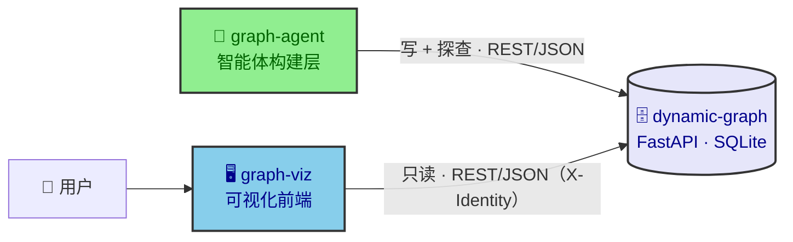
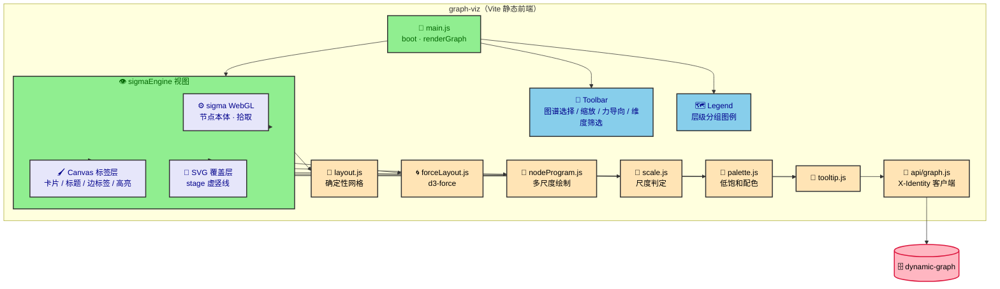

# 设计文档 · 前端可视化（graph-viz）

> graph-viz 是 coding-graph 的**只读可视化前端**：Vite 静态应用 + sigma 3（WebGL）+ graphology + antd（仅维度筛选面板用 React）。只消费 dynamic-graph 读端点，不触发写请求。
> 实现配套：`graph-viz/docs/图谱引擎.md`（引擎）、`graph-viz/docs/组件.md`（组件）。

## 1. 系统定位

- **只读展示**：布局、多尺度、筛选、交互均为展示层职责，不触发写请求；
- **身份注入**：`X-Identity` 头（base64(JSON)）由调用方注入，后端按身份过滤图谱列表；
- **数据驱动**：节点 / 关系 / 类型 / 维度字典全部经接口下发，不硬编码业务枚举。

## 2. 架构与渲染分层

**三层渲染各司其职**：WebGL 本体层负责"可交互的图形"（圆点 + 边 + 拾取命中）；Canvas 标签层负责"可读的内容"（卡片 / 标题 / 边标签 / 高亮，屏幕坐标）；SVG 覆盖层负责"结构提示"（stage 虚竖线，随相机与布局 tick 重算）。三层解耦，互不干扰、可独立退化。

## 3. 文档索引

| 文档 | 内容 |
|---|---|
| [加载流程.md](加载流程.md) | 图谱加载数据流、视图生命周期 |
| [多尺度展示.md](多尺度展示.md) | 三态切换、动态卡片临界与进出对称、卡片渲染 |
| [布局.md](布局.md) | 确定性网格、d3-force 力导向 |
| [维度筛选.md](维度筛选.md) | 三态机制、与力导向协作 |
| [交互.md](交互.md) | 交互矩阵、节点拖拽 |
| [界面与视觉.md](界面与视觉.md) | 配色、工具栏、图例 |
