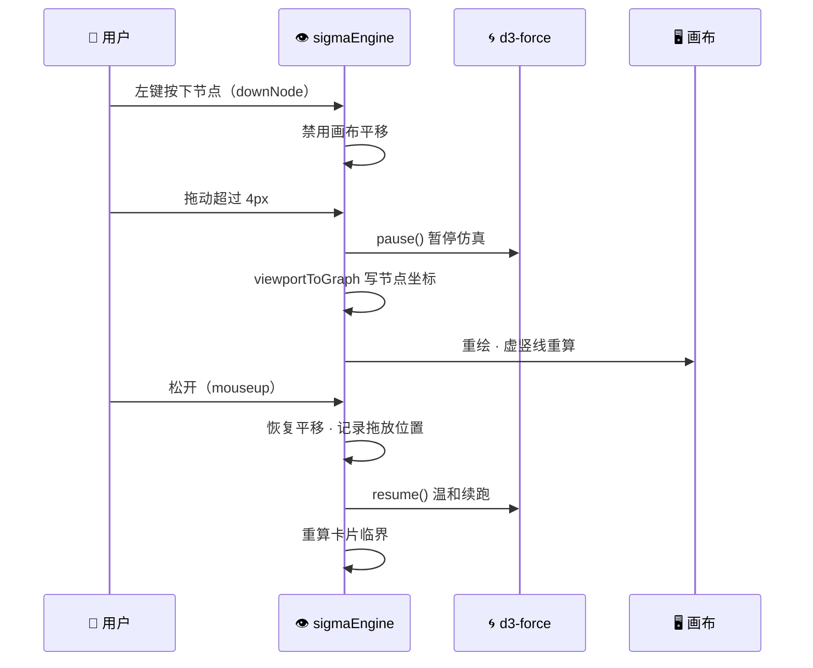

# 设计文档 · graph-viz 交互

| 交互 | 行为 |
|---|---|
| 图谱选择 | 本人图谱下拉（最近更新优先），切换即重建视图 |
| 滚轮 / 双击 / 缩放按钮 | 相机缩放（并置 userZoomed 冻结阈值） |
| 空白处拖拽 | 平移画布 |
| 节点拖拽 | 左键按住节点 → 移动该节点（画布不平移） |
| 悬停节点 | 属性浮层 + 节点色高亮环 |

## 节点拖拽时序

