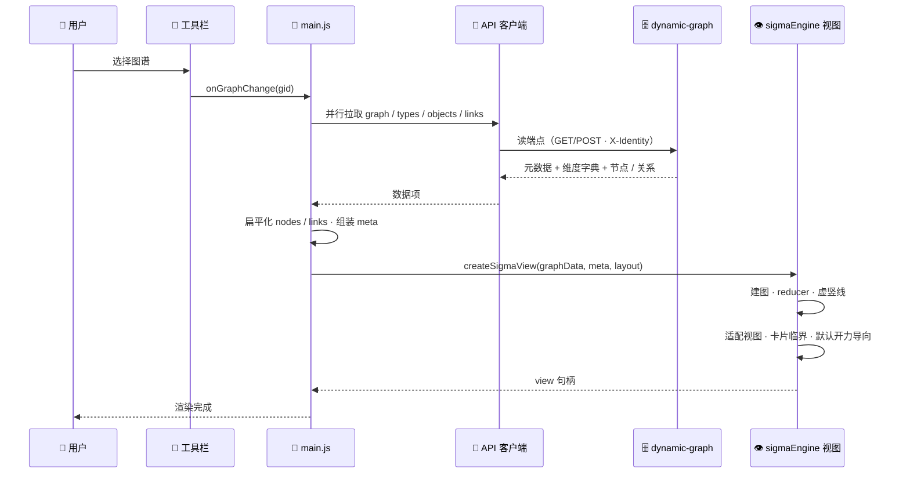

# 设计文档 · graph-viz 加载流程

## 1. 数据流：图谱加载

四类数据**并行拉取**后在展示层扁平化为统一节点 / 关系模型，再确定性布局、建视图、适配。

## 2. 视图生命周期

- **切换图谱**：旧视图整体销毁重建（停止力导向、释放 sigma、移除 SVG 覆盖层）；
- **工具栏常驻**：经 `swap` 换绑当前视图、下拉选中值与维度面板，无需重建；
- **失败兜底**：加载异常在容器内展示错误信息。
