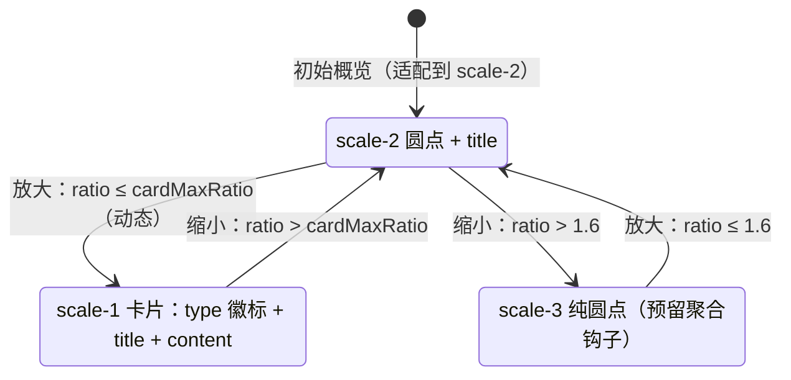

# 设计文档 · graph-viz 多尺度展示

## 1. 三态切换

不做简单缩放，而是**样式切换**；尺度由相机 ratio（越小越放大，单一连续值）判定：

## 2. 为什么用 ratio 判定、而不是监听缩放事件

sigma 没有离散的"放大 / 缩小"事件，相机状态本身就是一个连续 ratio；方向须由相邻两次状态推出，携带滞后。而用单一阈值比较当前 ratio 即可唯一确定尺度，**进出天然对称**（同一阈值，方向无关）。`camera.on("updated")` 在每次相机变化时触发，作为尺度切换的唯一入口。

## 3. 卡片临界：动态阈值与进出对称

- 卡片临界 `cardMaxRatio` 是**动态值**：按当前布局实测"卡片恰好不重叠"的最大放大比——逐对节点在 ratio=1 参考系投影，取 `max(dx/GW, dy/GH)` 的全局最小值，再夹在适配比 ×0.9 之下（保证初始概览落圆点态）、下限 0.25。布局变化（建图 / 力导向收敛 / 维度剔除 / 节点拖拽）后重算。
- **进出对称**：进 / 出卡片穿越同一阈值。但阈值会随布局变化重算——若用户恰在收敛前放大、收敛后缩小，会穿越两个不同值（实测 0.367→0.271）。因此用户**已手动缩放**（滚轮 / 缩放按钮 / 双击）后，力导向收敛不再重算临界、也不拉回相机——**阈值冻结**，一次"放大→缩小"穿越同一值；仅用户未干预的初始收敛才做一次干净的重算 + 适配。

## 4. 卡片渲染：本体与卡面解耦

- 卡片态把 WebGL 本体圆点**置全透明隐藏**（而非删除）：sigma 的可见色与拾取 id 是同一顶点缓冲的独立字段——圆点不绘制但悬停 / 点击 / 拖拽仍命中，且任意缩放深度都不会有圆点从卡边冒出；
- 卡面由标签层用**原色快照 `baseColor`** 绘制（type 徽标淡底 + 不透明卡身 + title/content），不随半透明态连带变透明；
- 本体尺寸在卡片边界与 scale-2 保持一致（不做切换补间）→ 退出卡片不闪大圆点；卡片态单独放大**拾取半径**，整卡可点可拖。
