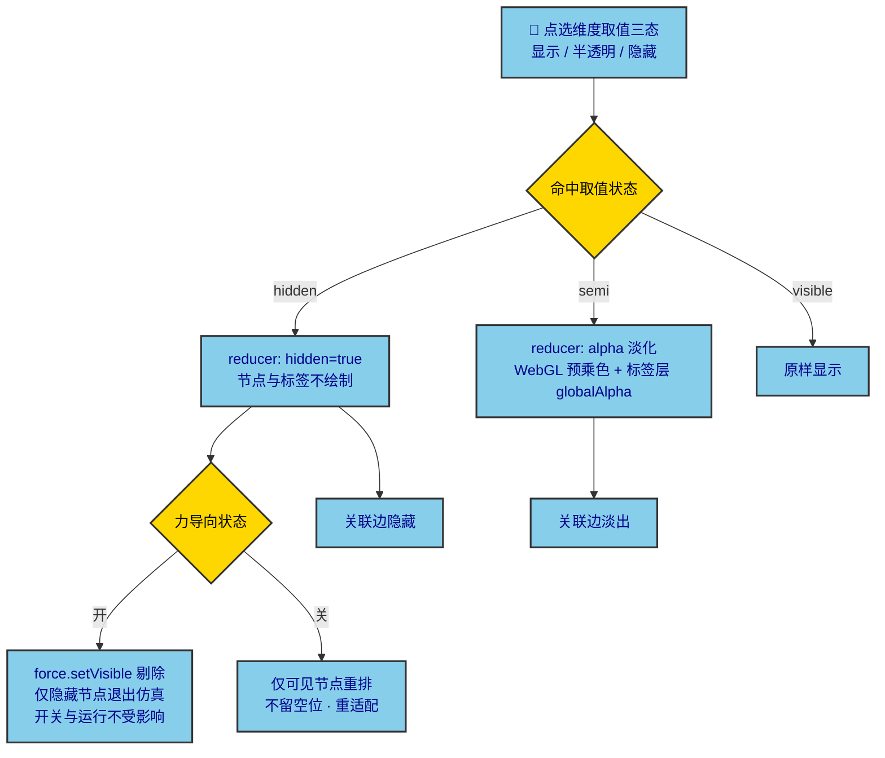

# 设计文档 · graph-viz 维度筛选

维度集合由接口下发的维度字典 `graph.dims` 驱动，每个取值三态循环：

**与力导向的协作**：切换维度**不影响力导向的开关与运行**——隐藏节点仅退出仿真（`setVisible` 只让可见节点继续受力），不重排坐标、不拉相机；仅当力导向关闭时才整图重排。半透明态不改变拓扑，只做自身 alpha 淡化（WebGL 圆点用预乘色、标签层用 `globalAlpha`），关联边随之淡出 / 隐藏。
